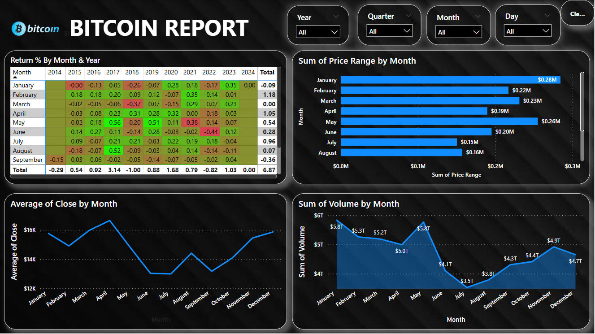

# powerbi-Bitcoin-2014-2024-report
Hey guys this report shows the open, low, high and low of bitcoin and also volume, price range along with daily percent change over the years from 2014 to 2024 

It provides insights into Bitcoin’s price trends, trading volume, and other key metrics over the last decade.

📂 Files
- `BTC-USD (2014-2024).csv` — Original Raw data in csv format
- `Bitcoin_Report_2014-2024.pbix` — The Power BI report file
- `screenshot.png` — A preview of the dashboard

📊 Dashboard Highlights
- Year-over-year Bitcoin price movements
- Monthly & quarterly trends
- Volume vs. price correlation
- Peak and lowest price periods
- Key events influencing price fluctuations

LIMITATION:-
1. This data only consist the months of 2014 from September
2. The year 2024 only has the month of January
3. You can add data to it but the new data should have the same structure as this data
   
🔷 How to Use
1️⃣ Download the `.pbix` file.  
2️⃣ Open it in [Power BI Desktop](https://powerbi.microsoft.com/desktop/).  
3️⃣ Interact with the visuals and explore the insights.

🖼️ Preview

📌  Please Note
- The data used is public and for educational purposes only.
- No sensitive data is included.
